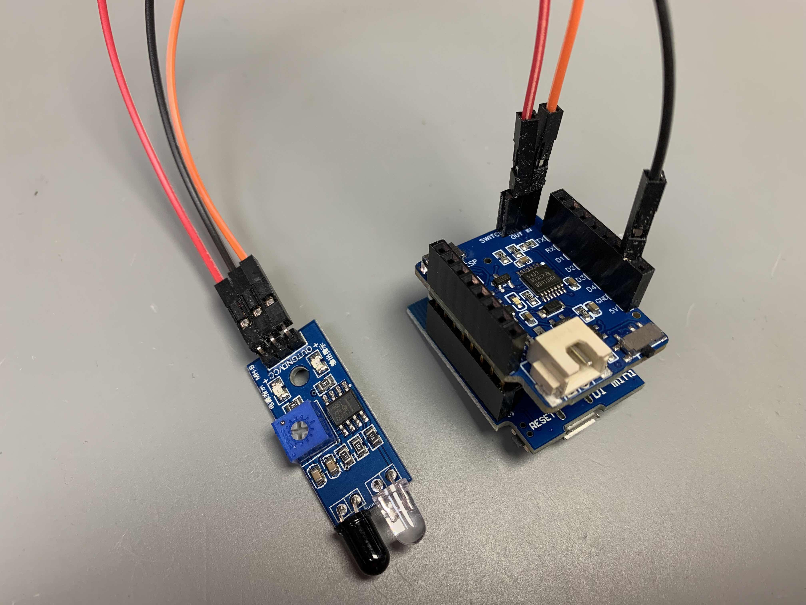

# Arduino energy and gas meter monitoring with a Wemos D1 Mini over mqtt

::: energy meter :::
This is how your basic setup should look like if you use a IR Sensor breakout board to count each cycle.
RED - VIN - SWITCH_OUT (3V3)
BLACK - GND
ORANGE - SIGNAL - SWITCH_IN

  
::: gas meter ::: 
- Setup A (recommended for battery): Reed switch connected to SWITCH OUT/IN on a MicroWakeupper battery shield (stacked to a Wemos D1 mini)

- Setup B (external power/USB): Inductive proximity sensor LJ12A3-4-Z/BX 5V connected with signal line to SWITCH IN (common GND) on a MicroWakeupper battery shield (stacked to a Wemos D1 mini). The sensor usually consumes about 50mA (always on).
  
---

There are different gas meters in the wild - usually one with 
a) an internal magnet that is turning around on each cycle - so we can use a reed switch for counting
or
b) an internal metal plate is turning around on each cycle - so we can use a proximity sensor LJ12A3-4-Z/BX 5V

Usually one turn around is euqal to 0,01m3 (or 10 liters) of gas - check your gas meter.

The stacked MicroWakeupper shield is turning your Wemos D1 mini on and off. Recommended: onboard jumper J1 cutted!
  
tldr; The firmware will count each cycle, write the total amount to eeprom and sent a mqtt message to your broker with the total amount of gas (total).
  
## Setup/Installation
1. Install the MicroWakeupper library (https://github.com/tstoegi/MicroWakeupper) to your Arduino IDE 
2. Update the sketch file "config.h" with your custom setup
3. Connect a Wemos D1 mini (or pro, with external antenna) via USB and upload the code (if the MicroWakeupper shield if already stacked, you have to press the onboard FLASH button during upload) 
   
   -> OTA: If the firmware is already installed, you can use OTA updates by setting (with retain) a mqtt msg/value "/settings/waitForOTA" to "true" once. OTA will be available for one minute.
  
Warning: As long as you power the Wemos via USB (or external VIN) the MicroWakeupper shield cannot turn it off.

All mqtt messages from the client (Wemos) are sent with flag "retain" - so you see the last messages, even if the device is off.
  
## faq
Q: Where can I buy the MicroWakeupper battery shield?
 
A: My store: https://www.tindie.com/stores/moreiolabs/

Q: How can I set an initial counter value?
 
A: Just send/publish a mqtt message (with retain!) to "haus/gasmeter/settings/total" e.g. "202.23" - after receiving that message is removed and you should see the new value.

Q: How can I install OTA update (via Arduino IDE)?
 
A: Send/publish a mqtt message (with retain!) to "haus/gasmeter/settings/waitForOTA" with "true" - after receiving that message is removed and you will see the OTA device named "[device_name]_[ip_address]".

Q: How can I adjust (calibrate) the battery voltage value?
 
A: Send/publish a mqtt message (with retain!) to "haus/gasmeter/settings/voltageCalibration" e.g. "+0.3" or "-0.5" volt - the message has to stay there!

(c) 2022, 2023 @tstoegi, Tobias Stöger, MIT license
  
